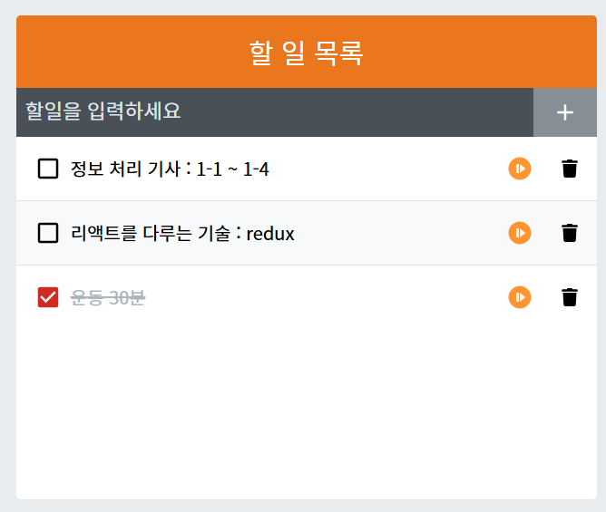
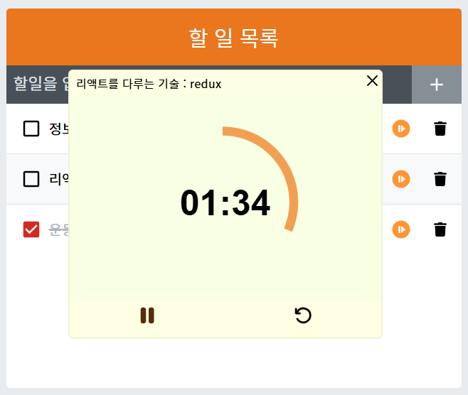
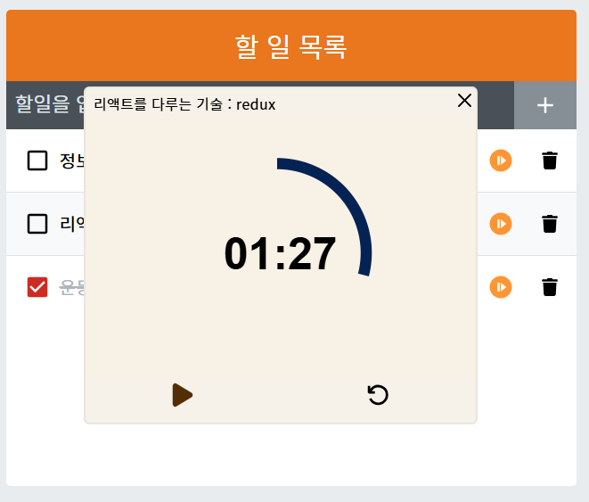

# Todo list

Simple 디자인의 todo list
24.12.19 ~ 24.12.25

# 소개
책 '리액트를 다루는 기술'을 읽으며 개발한 todo list.

todo list에 타이머 기능을 추가해보았습니다.

저는 할 일 목록을 적을 때, 메모장에 적어두곤 합니다. 그리고 그 할일들을 구글 타이머를 이용하여, 제한시간을 두면서 처리해나갑니다. 매번 메모장과 타이머를 같이 켜두는 것이 귀찮아서 두 기능을 한번에 담은 간단한 서비스 웹을 개발하게 되었습니다.

### 1. 타이머
남은 시간을 가시화하여 직관적으로 볼 수 있게 만들고 싶었습니다. 남은 시간을 눈으로 보며 집중하게 만들기 위함입니다. 구글의 타이머 디자인을 참고하여 만들었습니다.

  1-1. timer timer

### 2. todo list
  todo list 업무 목록을 저장하기 위해서 각 업무id가 겹치지 않아야합니다. 겹치지 않게 하기 위해, time과 업무내용 값을 가지고 해시처리를 하였습니다.
  
  2-1. 해시함수 
  localStorage를 통해 저장하고 불러오기. 이때 문제가 되는 점이 key가 충돌될 수 있다는 점이었습니다.현재 날짜와 할일의 이름을 이용하여 해시 키를 만들었습니다. 동일한 날짜에 동일한 업무를 적지 않는다고 가정(실제로 그런일이 드물기 때문에)하여 위와 같은 방식을 사용하였습니다.

  하지만 해시함수는 단방향이기 때문에, id를 생성할 수는 있지만, id를 다시 찾아낼 수는 없습니다. 그래서 id를 별도로 저장한 목록을 만들어서 관리하였습니다.

## 힘들었던 점
### 1. style 적용
컴포넌트 기반으로 JSX를 사용하여 반환하는데, 해당 컴포넌트에 별도로 style을 처리하기가 어려웠다. 특히 컴포넌트가 반환하는 요소들이 너무 많다보니, 어디에 어떤 스타일을 적용해야하는지 파악하기가 어려웠다.